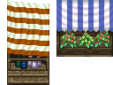

### LPC Bazaar Rework Sources

[OpenGameArt.org submission](https://opengameart.org/node/81369)

Bazaar tables & food by [Zachariah Husiar (Zabin)](https://opengameart.org/user/3356) & [Daniel Eddeland (daneeklu)](https://opengameart.org/user/2667):
- Sources:
  - [RPG Tiles: Cobble stone paths & town objects](https://opengameart.org/node/14914) (CC BY-SA 3.0)
  - [[LPC] Farming tilesets, magic animations and UI elements](https://opengameart.org/node/11117) (CC BY-SA 3.0 / GPL 3.0)
    - [original submission](https://opengameart.org/content/farming-tilesets-magic-animations-and-ui-elements)

Colored bottles by [Tuomo Untinen (Reemax)](https://opengameart.org/user/5257):
- Source: [[LPC] House interior and decorations](https://opengameart.org/node/32386) (CC BY-SA 3.0 / GPL 2.0+)

Flowers by [Jetrel](https://opengameart.org/user/402):
- Source: [RPG item set](https://opengameart.org/node/4531) (CC0)

White/Lavender bottles by [Hyptosis](https://opengameart.org/user/2937):
- Source: [Mage City Arcanos](https://opengameart.org/node/11192) (CC0)
