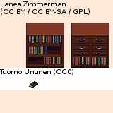

### LPC Shelves Rework Sources

<table style="border: 0px;">
  <tr style="border: 0px;">
    <td style="border: 0px; vertical-align: top;">
      
    </td>
    <td style="border: 0px;">
      
    </td>
  </tr>
</table>

[OpenGameArt.org submission](https://opengameart.org/node/81362)

By [Lanea Zimmerman (Sharm)](https://opengameart.org/user/1727) & [William Thompson](https://opengameart.org/user/7593):
- bookshelf & drawer_shelf
  - Sources:
    - [Liberated Pixel Cup (LPC) Base Assets](https://opengameart.org/node/13470) (CC BY-SA 3.0 / GPL 3.0)
    - [LPC: Modified base tiles](https://opengameart.org/node/40554) (OGA BY 3.0 / CC BY 3.0 / CC BY-SA 3.0 / GPL 3.0)

By [ak-blanc](https://opengameart.org/user/27293)???:
- book on middle shelf
  - Source: [[LPC] Misc tile atlas](https://opengameart.org/node/49103) (CC BY-SA 3.0??? / GPL 3.0???, see: [comment #66380](https://opengameart.org/node/49103#comment-66380))

By [Tuomo Untinen (Reemax)](https://opengameart.org/user/5257):
- book on bottom shelf
  - Source: [[LPC] House interior and decorations](https://opengameart.org/node/32386) (CC0, see: [comment #66379](https://opengameart.org/node/32386#comment-66379))
