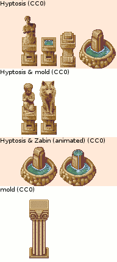

### Statues Collection Sources

<table style="border: 0px;">
  <tr style="border: 0px;">
    <td style="border: 0px;">
      
    </td>
    <td style="border: 0px; vertical-align: top; text-align: left;">
      
    </td>
  </tr>
</table>

[OpenGameArt.org submission](https://opengameart.org/node/81798)

By [Casper Nilsson](https://opengameart.org/user/2664):
- foodog from [LPC Contest Entry](https://opengameart.org/content/lpc-cnilsson) (CC BY-SA 3.0 / GPL 3.0)

By [Clint Bellanger](https://opengameart.org/users/Clint-Bellanger):
- tombwoof from [Tombwoof Tiles](https://opengameart.org/node/3435) (CC BY 3.0)

By [Daniel Cook](https://plus.google.com/+DanielCookGameDesign):
- stone armor from [lostgarden.com](http://www.lostgarden.com/2006/07/more-free-game-graphics.html)
  - OpenGameArt.org submission by Zabin: [2d Lost Garden Zelda style tiles resized to 32x32 with additions](https://opengameart.org/node/11758) (CC BY 3.0)

By [Hyptosis](https://opengameart.org/user/2937):
- bust, column, & fountains from [Mage City Arcanos](https://opengameart.org/node/11192) (CC0)

By [Hyptosis](https://opengameart.org/user/2937) & [mold](https://opengameart.org/user/12427):
- child praying (CC0) (based on [CC0 image](https://www.publicdomainpictures.net/view-image.php?image=191696&picture=statue-of-praying-boy))
- wolf (CC0) (based on [CC0 image](https://pixabay.com/en/wolf-photo-manipulation-white-png-2104703/))

By [Hyptosis](https://opengameart.org/user/2937) & [Zachariah Husiar (Zabin)](https://opengameart.org/user/3356):
- animated large fountain from [Mage City Arcanos](https://opengameart.org/node/11192), reworked & animated by Zabin (CC0)

By [mold](https://opengameart.org/users/mold):
- column-2 from [pixel column](https://opengameart.org/node/82265) (CC0)

By [Rayane F�lix (RayaneFLX)](https://opengameart.org/user/42888):
- knight w/ sword, owls, & bear from [Statues](https://opengameart.org/node/70109) (CC BY-SA 3.0)

By [TheraHedwig](https://opengameart.org/user/32795):
- romanic angel from [LPC Compatible Ancient Roman Architecture](https://opengameart.org/node/64532) (CC BY-SA 3.0 / GPL 3.0)
