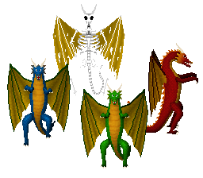

### Stendhal Dragons Sprites Sources

<table style="border: 0px;">
  <tr style="border: 0px;">
    <td style="border: 0px; vertical-align: top; text-align: center;">
      
    </td>
    </tr>
    <tr style="border: 0px;">
    <td style="border: 0px; vertical-align: top; text-align: center;">
      
    </td>
  </tr>
</table>

All artwork Copyright © 2017-2018 Kimmo Rundelin

[OpenGameArt.org submission](https://opengameart.org/node/81282)

Sprites:
- *blue_dragon* from commit [3a64993](https://github.com/arianne/stendhal/blob/3a64993/data/sprites/monsters/huge_animal/blue_dragon.png)
- *bone_dragon* from commit [97dff39](https://github.com/arianne/stendhal/blob/97dff39/data/sprites/monsters/huge_animal/bone_dragon.png)
- *green_dragon* from commit [85e4db3](https://github.com/arianne/stendhal/blob/85e4db3/data/sprites/monsters/huge_animal/green_dragon.png)
- *red_dragon* from commit [3c493b0](https://github.com/arianne/stendhal/blob/3c493b0/data/sprites/monsters/huge_animal/red_dragon.png)
