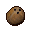
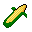
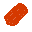
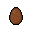
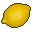
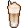
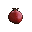

### Food Icons

Licensing: [OGA BY 3.0](http://static.opengameart.org/OGA-BY-3.0.txt)

Created by Jordan Irwin (AntumDeluge)

-  banana (based on [CC0 vector image from OCAL](https://freesvg.org/edible-yellow-fruit-clip-art))
-  coconut (based on [CC0 photograph](https://commons.wikimedia.org/wiki/File:Coconut_face.jpg))
-  corn (based on [ScratchIO's 2d Cereals](https://opengameart.org/node/99282))
-  crab_meat
-  egg (based on [CC0 vector image from OCAL](https://freesvg.org/vector-illustration-of-white-egg))
  -  egg_chocolate
  -  egg_spotted
-  grapes (based on CC0 vector image from OCAL)
-  lemon (base on [CC0 vector image from OCAL](https://freesvg.org/lemon-vector-illustration))
-  milk (based on [CC0 vector image from OCAL](https://freesvg.org/milk-in-bottle-vector-image))
-  milkshake (based on [CC0 vector image from OCAL](https://freesvg.org/vector-clip-art-of-cup-of-caffee-latte))
-  pomegranate (based on [CC0 photograph](https://commons.wikimedia.org/wiki/File:Afghan_pomegranate_Kandahar.jpg))
-  sausage (based on [thekingphoenix's Icons: Food](https://opengameart.org/node/77345))
  -  sausage_cheese
  -  sausage_ham
