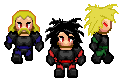

### Blordrough Sprites Sources

<table style="border: 0px;">
  <tr style="border: 0px;">
    <td style="border: 0px; vertical-align: top; text-align: center;">
      
    </td>
    </tr>
    <tr style="border: 0px;">
    <td style="border: 0px; vertical-align: top; text-align: center;">
      
    </td>
  </tr>
</table>

[OpenGameArt.org submission](https://opengameart.org/node/87473)

#### Source Assets:
---

By [Eldiran](https://opengameart.org/users/eldiran):
- [32x32 RPG Character Sprites](https://opengameart.org/node/50932) (CC0)

By [Svetlana Kushnariova (Cabbit)](https://opengameart.org/users/cabbit):
- [24x32 bases](https://opengameart.org/node/24944) (CC0)
