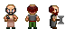

### Stendhal Handymen Sprites Sources

<table style="border: 0px;">
  <tr style="border: 0px;">
    <td style="border: 0px; vertical-align: top; text-align: center;">
      
    </td>
  </tr>
  <tr style="border: 0px;">
    <td style="border: 0px; vertical-align: top; text-align: center;">
      
    </td>
  </tr>
</table>

[OpenGameArt.org submission](https://opengameart.org/node/82370)

By [GrumpyDiamond](https://opengameart.org/user/32684) & [Jordan Irwin (AntumDeluge)](https://opengameart.org/user/5625):
- [Battle Axe/Weapons Rework](https://opengameart.org/node/82261) (CC0)

By [Svetlana Kushnariova (Cabbit)](https://opengameart.org/user/15048):
- [24x32 bases](https://opengameart.org/node/24944) (CC0)
- [24x32 characters, 16x16 tiles](https://opengameart.org/node/72969) (OGA BY 3.0 / CC BY 3.0)
