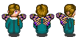

### Oracle Sprites Sources

<table style="border: 0px;">
  <tr style="border: 0px;">
    <td style="border: 0px; vertical-align: top; text-align: center;">
      
    </td>
  </tr>
  <tr style="border: 0px;">
    <td style="border: 0px; vertical-align: top; text-align: center;">
      
    </td>
  </tr>
</table>

[OpenGameArt.org submission](https://opengameart.org/node/83626)

#### Source Assets:
---

By [leangoro](https://openclipart.org/user-detail/leangoro):
- [butterfly/fairy wings](https://openclipart.org/detail/194497) (CC0)

By [leangoro](https://openclipart.org/user-detail/leangoro) & [olonu](https://github.com/olonu):
- [Re-worked butterfly/fairy wings (Little fairy redone)](https://github.com/arianne/stendhal/issues/149) (CC0)

By [Nila122](https://opengameart.org/users/nila122):
- [3 hairs for LPC](https://opengameart.org/node/29293) (CC BY-SA 3.0)

By [Svetlana Kushnariova (Cabbit)](https://opengameart.org/users/cabbit):
- [24x32 bases](https://opengameart.org/node/24944) (CC0)
- [24x32 characters, 16x16 tiles](https://opengameart.org/node/72969) (OGA BY 3.0 / CC BY 3.0)
