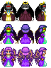

### Devil Queen (et al.) Sprites Sources

<table style="border: 0px;">
  <tr style="border: 0px;">
    <td style="border: 0px; vertical-align: top; text-align: center;">
      
    </td>
    </tr>
    <tr style="border: 0px;">
    <td style="border: 0px; vertical-align: top; text-align: center;">
      
    </td>
  </tr>
</table>

#### Source Assets:
---

By [diamonddmgirl](https://opengameart.org/users/diamonddmgirl):
- [Edited and Extended 24x32 Character Pack](https://opengameart.org/node/66147) (OGA BY 3.0)

By [johnny_automatic](https://openclipart.org/user-detail/johnny_automatic):
- [reclining devil](https://openclipart.org/detail/4365) (CC0)

By [liftarn](https://openclipart.org/user-detail/liftarn):
- [Angel wings](https://openclipart.org/detail/232340) (CC0)

By [Svetlana Kushnariova (Cabbit)](https://opengameart.org/users/cabbit):
- [24x32 bases](https://opengameart.org/node/24944) (CC0)
