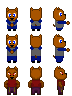

### Kobold Sprite Sources

<table style="border: 0px;">
  <tr style="border: 0px;">
    <td style="border: 0px; vertical-align: top;">
      
    </td>
    <td style="border: 0px; vertical-align: top;">
      
    </td>
  </tr>
</table>

[OpenGameArt.org submission](https://opengameart.org/node/81952)

By [GrumpyDiamond](https://opengameart.org/user/32684):
- [Pixel Weapons1](https://opengameart.org/node/54590) (CC0)

By [GrumpyDiamond](https://opengameart.org/user/32684) & [Jordan Irwin (AntumDeluge)](https://opengameart.org/user/5625):
- [Battle Axe / Weapons Rework](https://opengameart.org/node/82261) (CC0)

By [Michael Williams (BizmasterStudios)](https://opengameart.org/user/34190):
- [Bow Icons (From "PixelTime" Videos)](https://opengameart.org/node/66349) (CC BY 3.0)
- [Shield Icons (from "PixelTime" videos)](https://opengameart.org/node/64857) (CC BY 3.0)

By [Svetlana Kushnariova (Cabbit)](https://opengameart.org/user/15048):
- [24x32 bases](https://opengameart.org/node/24944) (CC0)
- [24x32 characters, 16x16 tiles](https://opengameart.org/node/72969) (OGA BY 3.0 / CC BY 3.0)

By [Svetlana Kushnariova (Cabbit)](https://opengameart.org/user/15048) & [diamonddmgirl](https://opengameart.org/user/39061):
- [24x32 Black Character Pack](https://opengameart.org/node/72198) (OGA BY 3.0 / CC BY 3.0)

By [yolkati](https://opengameart.org/user/1404):
- [Dog soldier](https://opengameart.org/node/15636) (CC BY-SA 3.0)
