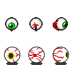

### Observer Sprites Sources

<table style="border: 0px;">
  <tr style="border: 0px;">
    <td style="border: 0px; vertical-align: top; text-align: center;">
      
    </td>
    </tr>
    <tr style="border: 0px;">
    <td style="border: 0px; vertical-align: top; text-align: center;">
      
    </td>
  </tr>
</table>

#### Source Assets:
---

By [Code Inferno Games](http://codeinferno.com/):
- [Rotating eyeball animation](https://opengameart.org/node/66464) (CC0)

By [Stephen Challener (Redshrike)](https://opengameart.org/users/redshrike):
- [A load of overworld 3/4 RPG sprites](https://opengameart.org/node/5215) (OGA BY 3.0 / CC BY 3.0)
