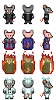

### Ratfolk Sprites Sources

<table style="border: 0px;">
  <tr style="border: 0px;">
    <td style="border: 0px; vertical-align: top; text-align: center;">
      
    </td>
    </tr>
    <tr style="border: 0px;">
    <td style="border: 0px; vertical-align: top; text-align: center;">
      
    </td>
  </tr>
</table>

[OpenGameArt.org submission](https://opengameart.org/node/82451)

By [One Man Army](https://opengameart.org/user/40926):
- [Pig Chef [48x48]](https://opengameart.org/node/69527) (CC0)

By [Stephen Challener (Redshrike)](https://opengameart.org/users/Redshrike):
- [Rat and Rat King overworld (antifarea style)](https://opengameart.org/node/4031) (CC BY 3.0)

By [Svetlana Kushnariova (Cabbit)](https://opengameart.org/users/Cabbit):
- [24x32 bases](https://opengameart.org/node/24944) (CC0)
