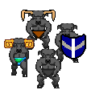

### Sheepmen Sprites Sources

<table style="border: 0px;">
  <tr style="border: 0px;">
    <td style="border: 0px; vertical-align: top;">
      
    </td>
    <td style="border: 0px;">
      
    </td>
  </tr>
</table>

[OpenGameArt.org submission](https://opengameart.org/node/81800)

By [Iwan Gabovitch (qubodup)](https://opengameart.org/user/6):
- [Sword and shield (16x16)](https://opengameart.org/node/2769) (CC0)

By [Jordan Irwin (AntumDeluge)](https://opengameart.org/user/5625):
- [Minotaur](https://opengameart.org/node/76913) (OGA BY 3.0)
- [Dark Soldier Rework](https://opengameart.org/node/77901) (CC BY-SA 3.0)
  - **IMPORTANT:** Only parts used were from additions by Jordan Irwin who allows using OGA BY licensing here.

By [Stephen Challener (Redshrike)](https://opengameart.org/user/47):
- [A load of overworld 3/4 RPG sprites](https://opengameart.org/node/5215) (OGA BY 3.0)
