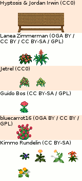

### Bench with Flowers Tilesets Sources

<table style="border: 0px;">
  <tr style="border: 0px;">
    <td style="border: 0px;">
      
    </td>
    <td style="border: 0px; vertical-align: top; text-align: left;">
      
    </td>
  </tr>
</table>

[OpenGameArt.org submission](https://opengameart.org/node/81665)

#### Source Assets:
---

By [bluecarrot16](https://opengameart.org/user/18016):
- [[LPC] Flowers / Plants / Fungi / Wood](https://opengameart.org/node/80124) (OGA BY 2.0+ / CC BY 2.0+ / GPL 2.0+)

By Guido Bos:
- [[LPC] Guido Bos entries cut up](https://opengameart.org/node/11319) (CC BY-SA 3.0 / GPL 3.0)

By [Hyptosis](https://opengameart.org/user/2937) & [Jordan Irwin (AntumDeluge)](https://opengameart.org/user/5625):
- [Wooden Bench Rework](https://opengameart.org/node/79117) (CC0)

By [Jetrel](https://opengameart.org/user/402):
- [RPG item set](https://opengameart.org/node/4531) (CC0)

By Kimmo Rundelin (kiheru):
- [Stendhal](https://github.com/arianne/stendhal/blob/master/tiled/tileset/plant/flower) (CC BY-SA 3.0)

By [Lanea Zimmerman (Sharm)](https://opengameart.org/user/1727):
- [LPC: Interior Castle Tiles](https://opengameart.org/node/17021) (OGA BY 3.0 / CC BY 3.0 / CC BY-SA 3.0 / GPL 3.0)
- [LPC Asset List (victorian furniture and decoration)](http://lpc.opengameart.org/static/lpc-style-guide/assets.html#building-indoors) (CC BY-SA 3.0 / GPL 3.0)
