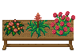
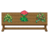

### Bench with Flowers Tileset Sources

Bench by [Hyptosis](https://opengameart.org/user/2937) & [Jordan Irwin (AntumDeluge)](https://opengameart.org/user/5625):
- [Wooden Bench Rework](https://opengameart.org/node/79117) (CC0)

*(flowers ordered left to right)*

Flowers 1 & 2 by [Lanea Zimmerman (Sharm)](https://opengameart.org/user/1727):
- [LPC: Interior Castle Tiles](https://opengameart.org/node/17021) (OGA BY 3.0 / CC BY 3.0 / CC BY-SA 3.0 / GPL 3.0)
- [LPC Asset List (victorian furniture and decoration)](http://lpc.opengameart.org/static/lpc-style-guide/assets.html#building-indoors) (CC BY-SA 3.0 / GPL 3.0)

Flower 3 by [bluecarrot16](https://opengameart.org/user/18016):
- [[LPC] Flowers / Plants / Fungi / Wood](https://opengameart.org/node/80124) (OGA BY 2.0+ / CC BY 2.0+ / GPL 2.0+)

Flowers 4 & 6 by [Jetrel](https://opengameart.org/user/402):
- [RPG item set](https://opengameart.org/node/4531) (CC0)

Flower 5 by Guido Bos:
- [[LPC] Guido Bos entries cut up](https://opengameart.org/node/11319) (CC BY-SA 3.0 / GPL 3.0)
